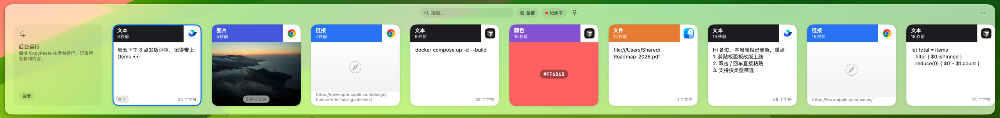
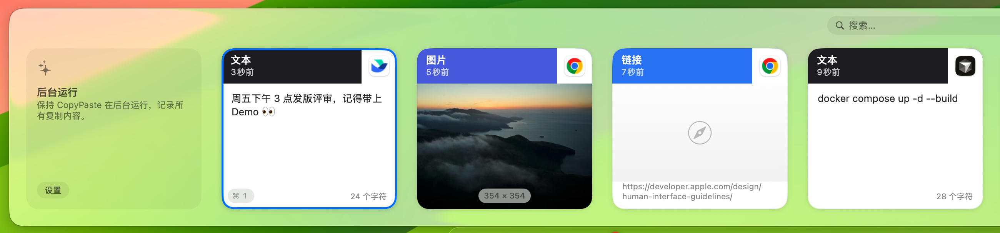
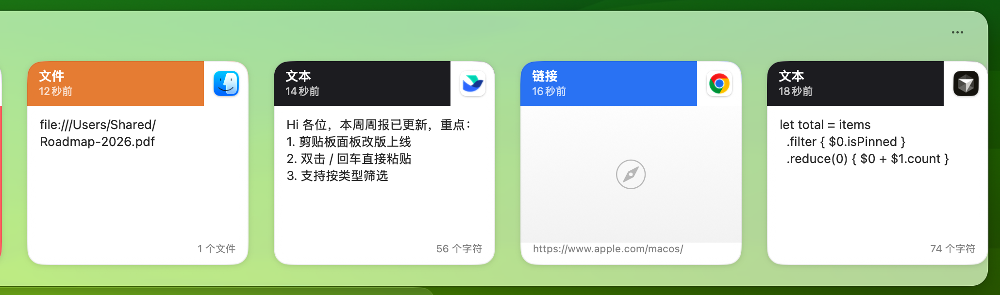

<div align="center">

# CopyPaste

**好看、好用、键盘优先的 macOS 剪贴板管理器**

<kbd>⇧</kbd> <kbd>⌘</kbd> <kbd>V</kbd> 唤出，<kbd>Enter</kbd> 即粘贴。复制过的一切，都在指尖。

*A beautiful, keyboard-first clipboard manager for macOS.*


</div>



---

## 为什么需要它

macOS 自带的剪贴板只记得**最后一次**复制。写代码时要来回搬的命令、写文档时要引用的链接、聊天里要反复发的地址……一旦被覆盖，就只能回去重新找。

CopyPaste 在后台默默记下你复制过的每一段文字、每一张图片、每一个链接和文件。需要时按下 <kbd>⇧</kbd> <kbd>⌘</kbd> <kbd>V</kbd>，屏幕底部滑出一条卡片时间线，选中、回车，内容就粘贴到了光标所在的位置——全程不用离开键盘。

## 功能亮点

### 卡片式时间线，一眼认出要找的内容

每条记录都是一张卡片：顶部颜色区分**文本 / 链接 / 图片 / 文件 / 颜色**，右上角是来源 App 的图标，下面标注复制时间和字数。图片直接显示缩略图和尺寸，颜色值直接渲染成色块。



### 原样呈现，所见即所得

多行文本保留真实换行，代码保留缩进，文件显示完整路径——不用点开，就知道这是不是你要的那一条。



### 三种方式，一步粘贴

- <kbd>←</kbd> <kbd>→</kbd> 选中卡片，按 <kbd>Enter</kbd> 粘贴
- 鼠标**双击**任意卡片直接粘贴
- <kbd>⌘</kbd> + <kbd>1</kbd>…<kbd>9</kbd> 直接粘贴最近的第 1～9 条

粘贴会自动回到你之前所在的 App 和光标位置，无需再按一次 <kbd>⌘</kbd> <kbd>V</kbd>。

### 即搜即得，按类型筛选

面板打开后直接打字就能搜索全部历史；点工具栏上的筛选按钮，可以只看文本、链接、图片或文件。

### 固定常用内容

常用的邮箱、地址、代码片段可以固定（<kbd>⌥</kbd> <kbd>P</kbd>），不会被新的复制挤掉，还能分配专属快捷键。

### 注重隐私

- 所有历史**只保存在本机**，不上传任何服务器
- 自动忽略密码管理器等应用标记为「隐藏」或「临时」的内容
- 可以在设置中排除指定 App，或用正则表达式忽略敏感内容
- 工具栏一键**暂停记录**，处理敏感信息时更安心

### 原生、轻量

纯 SwiftUI 构建，安装包约 3.5 MB，常驻菜单栏，几乎不占资源；支持浅色 / 深色模式和 40 多种界面语言。

## 快捷键

| 操作 | 快捷键 |
|------|--------|
| 唤出 / 关闭面板 | <kbd>⇧</kbd> <kbd>⌘</kbd> <kbd>V</kbd> |
| 在卡片间移动 | <kbd>←</kbd> <kbd>→</kbd> |
| 粘贴选中内容 | <kbd>Enter</kbd> 或鼠标双击 |
| 粘贴第 N 条（1～9） | <kbd>⌘</kbd> <kbd>N</kbd> |
| 以纯文本粘贴 | <kbd>⇧</kbd> <kbd>⌘</kbd> <kbd>Enter</kbd> |
| 仅复制，不粘贴 | <kbd>⌥</kbd> <kbd>Enter</kbd> |
| 搜索 | 面板打开后直接输入 |
| 固定 / 取消固定 | <kbd>⌥</kbd> <kbd>P</kbd> |
| 删除选中条目 | <kbd>⌥</kbd> <kbd>⌫</kbd> |
| 清空未固定的历史 | <kbd>⌥</kbd> <kbd>⌘</kbd> <kbd>⌫</kbd> |
| 清空全部历史 | <kbd>⇧</kbd> <kbd>⌥</kbd> <kbd>⌘</kbd> <kbd>⌫</kbd> |
| 关闭面板 | <kbd>Esc</kbd> |
| 打开设置 | <kbd>⌘</kbd> <kbd>,</kbd> |

唤出面板的快捷键可以在「设置 → 通用」中修改。

## 安装

### 下载安装包

1. 从 [Releases](https://github.com/LehmanHe/CopyPaste/releases/latest) 下载最新的 `CopyPaste-x.y.z.dmg`
2. 打开 DMG，把 **CopyPaste** 拖进「应用程序」
3. 在「应用程序」里双击打开 CopyPaste。如果被系统拦截，按下面的[「打不开怎么办」](#打不开怎么办)放行一次
4. 第一次粘贴时，按提示在「系统设置 → 隐私与安全性 → 辅助功能」中打开 CopyPaste 的开关

安装后 CopyPaste 会每天自动检查一次更新，有新版本时弹窗提示，一键即可升级；也可以在「设置 → 通用」里点「检查更新」，或关闭「自动检查更新」。

> 为什么需要辅助功能权限？CopyPaste 通过模拟一次 <kbd>⌘</kbd> <kbd>V</kbd> 把内容粘贴到你正在使用的 App 里，这是 macOS 对这类操作的统一要求。CopyPaste 不会读取屏幕内容，也不会记录键盘输入。

### 打不开怎么办

第一次打开时，macOS 可能提示 **「Apple 无法验证 CopyPaste 是否包含恶意软件」**，只给「完成」和「移到废纸篓」两个按钮。这是因为 CopyPaste 是免费开源软件，作者没有付费的 Apple 开发者账号，无法提交 Apple 公证，并不代表 app 有问题。任选一种方法放行**一次**即可，之后的自动更新不需要再操作。

**方法一：在系统设置里放行（macOS 15 Sequoia 及更新版本）**

1. 先双击 CopyPaste 一次，在弹窗里点「完成」
2. 打开「系统设置 → 隐私与安全性」，滚动到最下面的「安全性」
3. 在 CopyPaste 被阻止的提示旁边，点 **「仍要打开」**
4. 输入开机密码（或用触控 ID），在弹窗里再点一次「仍要打开」

「仍要打开」只在尝试打开后大约 1 小时内出现，没看到的话先重新双击一次 CopyPaste。

> macOS 14 Sonoma：在「应用程序」里按住 <kbd>Control</kbd> 点按 CopyPaste（或右键）→「打开」→ 在弹窗里再点「打开」。从 macOS 15 开始这个方法已经不再有效，请用方法一或方法二。

**方法二：终端一行命令（任意 macOS 版本）**

打开「终端」，粘贴下面这行并回车，然后正常双击打开：

```sh
xattr -dr com.apple.quarantine /Applications/CopyPaste.app
```

DMG 里也附带了一份 `打不开请看这里.txt`，内容和本节相同。

### 从源码构建

需要 macOS 14+ 和 Xcode 16+：

```sh
git clone https://github.com/LehmanHe/CopyPaste.git
cd CopyPaste
./scripts/build_dmg.sh
```

安装包会生成在 `build/` 目录下。

## 常见问题

**按回车只复制、没有粘贴？**
检查「设置 → 通用 → 行为」里的「自动粘贴」是否开启，并确认已授予辅助功能权限。

**已经授予了辅助功能权限，粘贴还是没反应？**
在「系统设置 → 隐私与安全性 → 辅助功能」里选中 CopyPaste，点「−」删掉，然后重新打开 CopyPaste 再授权一次。

**我装的是 1.0.0，收不到更新？**
1.0.0 的更新地址配置有误，请手动下载一次最新版覆盖安装，之后就能自动更新了。

**不想记录某个 App 里复制的内容？**
在「设置 → 忽略」中添加该 App，或者添加一条正则规则。

**历史会保存多久？**
默认保存最近 200 条，可以在「设置 → 存储」中调整数量，也可以设置退出时自动清空。

## 致谢

CopyPaste 基于优秀的开源项目 [Maccy](https://github.com/p0deje/Maccy) 二次开发，在它扎实的剪贴板引擎之上重新设计了卡片式界面和交互。感谢 Maccy 作者 Alex Rodionov 及所有贡献者。

## 许可证

[MIT](./LICENSE)
